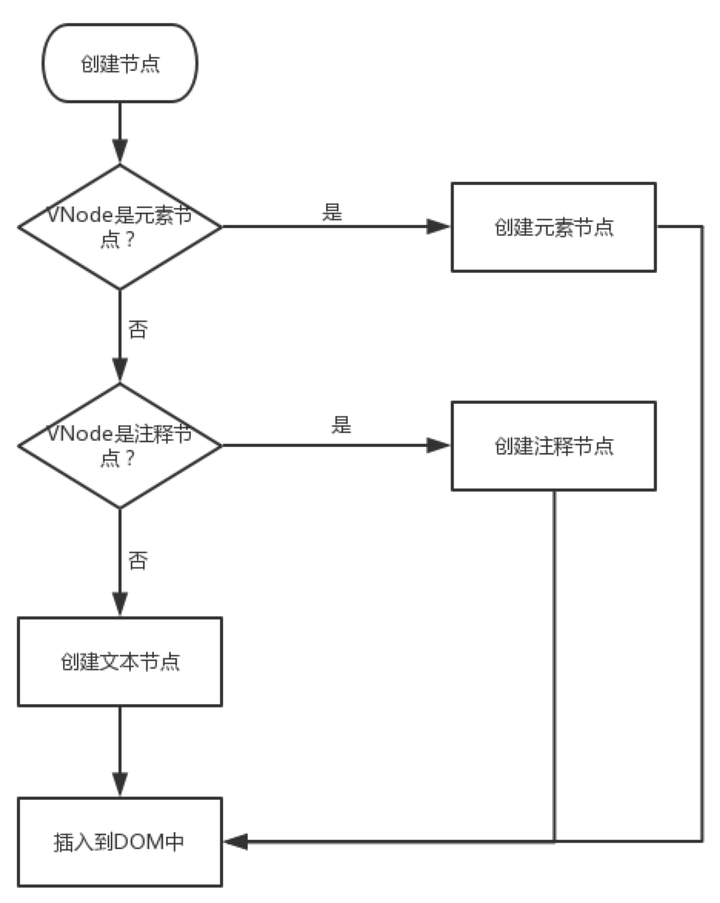
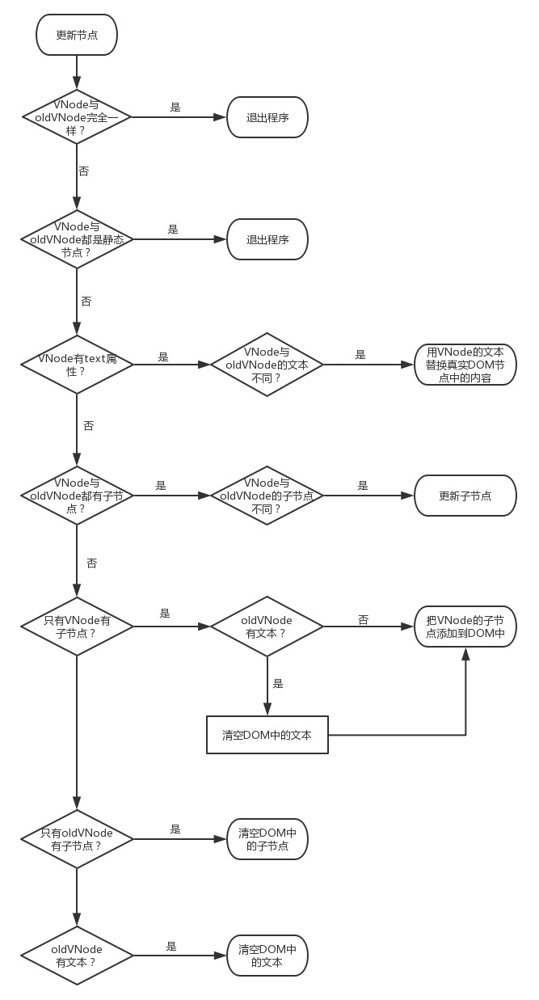
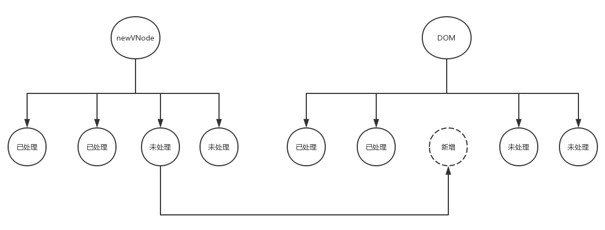
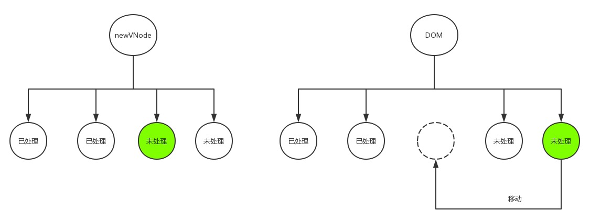
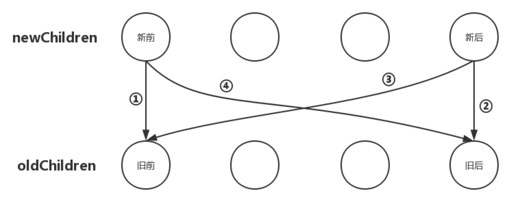
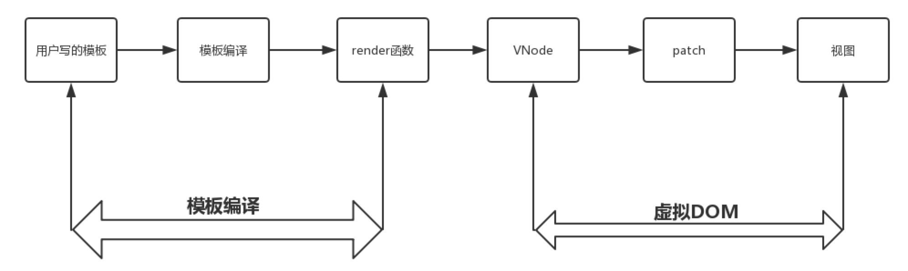
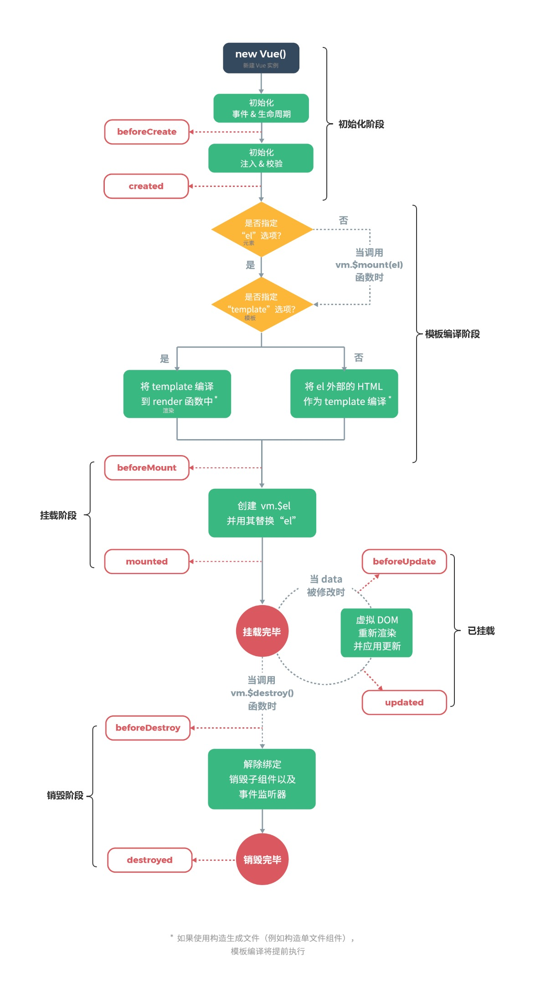
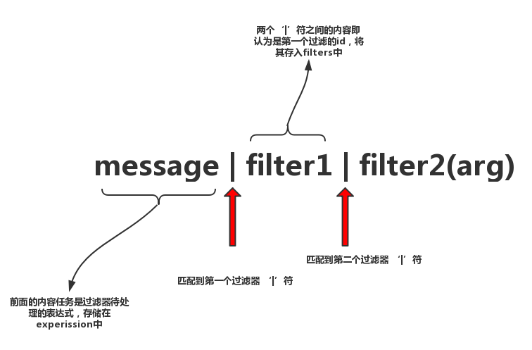

# v2.6.11 简易学习路线指南如下：

渐进式 JavaScript 框架（即有一个核心库，在需要的时候再逐渐添加插件的一种概念，大概意思就是你可以只用我的一部分，而不是用了我这一点就必须用我的所有部分）

vuejs 的组成是由 core 和 对应的 platforms 补充代码构成

vue 的目标是 通过尽可能简单的 API 实现响应的数据绑定 和 组合的视图组件

### 1.变化侦测篇

    双向绑定涉及到的技术：
    1. Object.defineProperty
    2. Observer 注入getter和setter
    3. Watcher 是变化侦测和更新view的一个纽带
    4. Dep 专门用来存储依赖用的,每个属性都有一个Dep
    5. Directive

#### Object 变化侦测篇

##### 学习 Vue 中如何实现数据的响应式系统，从而达到数据驱动视图。

    在Angular中是通过脏值检查流程来实现变化侦测；

    在React是通过对比虚拟DOM来实现变化侦测，

    在Vue中也有自己的一套变化侦测实现机制。

1.使 Object 数据变得“可观测” Observer 类 // [源码位置：src/core/observer/index.js](src/core/observer/index.js)

2.依赖收集 （在 getter 中收集依赖，在 setter 中通知依赖更新）Dep 类 // [源码位置：src/core/observer/dep.js](src/core/observer/dep.js)

3.依赖到底是谁 Watcher 类,watcher 主动将自己 push 到属性的依赖中,只有通过 watcher 读取属性的值才会收集依赖,模板是通过 watcher 读取属性的值的~ // [源码位置：src/core/observer/watcher.js](src/core/observer/watcher.js)

4.缺点 当我们向 object 数据里添加一对新的 key/value 或删除一对已有的 key/value 时，它是无法观测到的，导致当我们对 object 数据添加或删除值时，无法通知依赖，无法驱动视图进行响应式更新。当然，Vue 也注意到了这一点，为了解决这一问题，Vue 增加了两个全局 API:Vue.set 和 Vue.delete

##### 其整个流程大致如下：

    1.Data通过observer转换成了getter/setter的形式来追踪变化。
    2.当外界通过Watcher读取数据时，会触发getter从而将Watcher添加到依赖中。
    3.当数据发生了变化时，会触发setter，从而向Dep中的依赖（即Watcher）发送通知。
    4.Watcher接收到通知后，会向外界发送通知，变化通知到外界后可能会触发视图更新，也有可能触发用户的某个回调函数等

#### Array 变化侦测篇

1. 使 Array 型数据可观测（重新定义数组方法）数组方法拦截器 // [源码位置：src/core/observer/array.js](src/core/observer/array.js) 使用拦截器 // [源码位置：src/core/observer/index.js](src/core/observer/index.js)

2. 依赖收集，通知依赖// [源码位置：src/core/observer/index.js](src/core/observer/index.js) [源码位置 2: src/core/observer/array.js](src/core/observer/array.js)

3. 缺点：而使用下述例子中的操作方式来修改数组是无法侦测到的. Vue 增加了两个全局 API:Vue.set 和 Vue.delete

   ```
   let arr = [1,2,3]
   arr[0] = 5;       // 通过数组下标修改数组中的数据
   arr.length = 0    // 通过修改数组长度清空数组
   ```

##### 其整体流程如下：

    1.对于Array型数据也在getter中进行依赖收集
    2.创建了数组方法拦截器，从而成功的将数组数据变的可观测

### 2.虚拟 DOM 篇

#### 是什么？

    所谓虚拟DOM，就是用一个JS对象来描述一个DOM节点,如下事例：

```
<div class="a" id="b">文本内容</div>

{
    tag:'div',        // 元素标签
    attrs:{           // 属性
        class:'a',
        id:'b'
    },
    text:'文本内容',  // 文本内容
    children:[]       // 子元素
}
```

#### 为什么？

    1.Vue是数据驱动视图的，数据发生变化视图就要随之更新，在更新视图的时候难免要操作DOM,而操作真实DOM又是非常耗费性能的，这是因为浏览器的标准就把 DOM 设计的非常复杂，所以一个真正的 DOM 元素是非常庞大的

    2.用JS的计算性能来换取操作DOM所消耗的性能。（因为无法避免，那就只能尽量少的去操作DOM，对比变化，计算出更新，在操作需要更新的DOM）

#### 虚拟 DOM

1.VNode 类 // [源码位置：src/core/vdom/vnode.js](src/core/vdom/vnode.js)

2.VNode 的类型 // [源码位置：src/core/vdom/vnode.js](src/core/vdom/vnode.js)

> 注释节点

> 文本节点

> 克隆节点

> 元素节点

    更贴近于我们通常看到的真实DOM节点，由于元素节点所包含的情况相比而言比较复杂，源码中没有像前三种节点一样直接写死

> 组件节点

    组件节点除了有元素节点具有的属性之外，它还有两个特有的属性：
    componentOptions :组件的option选项，如组件的props等
    componentInstance :当前组件节点对应的Vue实例

> 函数式组件节点

    函数式组件节点相较于组件节点，它又有两个特有的属性：
    fnContext:函数式组件对应的Vue实例
    fnOptions: 组件的option选项

#### VNode 的作用

在视图渲染之前，把写好的 template 模板先编译成 VNode 并缓存下来，等到数据发生变化页面需要重新渲染的时候，我们把数据发生变化后生成的 VNode 与前一次缓存下来的 VNode 进行对比，找出差异，然后有差异的 VNode 对应的真实 DOM 节点就是需要重新渲染的节点，最后根据有差异的 VNode 创建出真实的 DOM 节点再插入到视图中，最终完成一次视图更新

以 JS 的计算性能来换取操作真实 DOM 所消耗的性能

#### DOM-Diff

在 Vue 中，把 DOM-Diff 过程叫做 patch 过程。patch,意为“补丁”，即指对旧的 VNode 修补，打补丁从而得到新的 VNode

    整个patch无非就是干三件事：

    创建节点：新的VNode中有而旧的oldVNode中没有，就在旧的oldVNode中创建。
    删除节点：新的VNode中没有而旧的oldVNode中有，就从旧的oldVNode中删除。
    更新节点：新的VNode和旧的oldVNode中都有，就以新的VNode为准，更新旧的oldVNode。

> 创建节点

VNode 类可以描述 6 种类型的节点，而实际上只有 3 种类型的节点能够被创建并插入到 DOM 中，它们分别是：元素节点、文本节点、注释节点。所以 Vue 在创建节点的时候会判断在新的 VNode 中有而旧的 oldVNode 中没有的这个节点是属于哪种类型的节点，从而调用不同的方法创建并插入到 DOM 中 [源码位置: src/core/vdom/patch.js
](src/core/vdom/patch.js)

流程图如下：



> 删除节点

[源码位置: src/core/vdom/patch.js
](src/core/vdom/patch.js)

> 更新节点

流程图如下：



#### 更新子节点

> > 更新子节点

    这个过程将会存在以下四种情况：

    1.创建子节点：如果newChildren里面的某个子节点在oldChildren里找不到与之相同的子节点，那么说明newChildren里面的这个子节点是之前没有的，是需要此次新增的节点，那么就创建子节点。

    2.删除子节点：如果把newChildren里面的每一个子节点都循环完毕后，发现在oldChildren还有未处理的子节点，那就说明这些未处理的子节点是需要被废弃的，那么就将这些节点删除。

    3.移动子节点：如果newChildren里面的某个子节点在oldChildren里找到了与之相同的子节点，但是所处的位置不同，这说明此次变化需要调整该子节点的位置，那就以newChildren里子节点的位置为基准，调整oldChildren里该节点的位置，使之与在newChildren里的位置相同。

    4.更新节点：如果newChildren里面的某个子节点在oldChildren里找到了与之相同的子节点，并且所处的位置也相同，那么就更新oldChildren里该节点，使之与newChildren里的该节点相同。

> > 创建子节点

显然，把节点插入到 DOM 中是很容易的，找到 **_合适的位置_** 是关键。那么创建好之后如何插入到 DOM 中的 **_合适的位置_** 呢？。分析如图 1：



分析如图 2：


    分析总结：其实，应该把新创建的节点插入到所有未处理节点之前，这样以来逻辑才正确。后面不管有多少个新增的节点，每一个都插入到所有未处理节点之前，位置才不会错。

    所以，合适的位置是所有未处理节点之前，而并非所有已处理节点之后。

> > 删除子节点

> > 更新子节点

> > 移动子节点

同样，移动一个节点不难，关键在于该移动到哪，或者说关键在于移动到哪个 **_位置_**，这个 **_位置_**才是关键。如下图：



    分析总结：所有未处理节点之前就是我们要移动的目的位置。
    如果此时你说那可不可以移动到所有已处理节点之后呢？
    那就又回到了更新节点时所遇到的那个问题了：如果前面有新增的节点呢？

// [源码位置： src/core/vdom/patch.js](src/core/vdom/patch.js)

    总结：Vue在更新子节点时是外层循环newChildren数组，内层循环oldChildren数组，把newChildren数组里的每一个元素分别与oldChildren数组里的每一个元素匹配，根据不同情况作出创建子节点、删除子节点、更新子节点以及移动子节点的操作。

#### 优化更新子节点



// [源码位置： src/core/vdom/patch.js](src/core/vdom/patch.js)

### 3.模板编译篇

    学习Vue内部是怎么把template模板编译成虚拟DOM,从而渲染出真实DOM

#### 整体渲染流程图如下：



#### 模板编译内部流程

    这里就涉及到AST（抽象语法树），比如：一个简单的HTML标签的代码被转换成了一个JS对象，而这个对象中的属性代表了这个标签中一些关键有效信息。
    对AST有兴趣的可以在这个网站在线转换试试：https://astexplorer.net/

其具体流程可大致分为三个阶段：// [源码位置: src/complier/index.js](src/complier/index.js)

1.模板解析阶段（解析器）：将一堆模板字符串用正则等方式解析成抽象语法树 AST； // [源码位置： src/compiler/parser/index.js](src/compiler/parser/index.js)

    一边解析不同的内容一边调用对应的钩子函数生成对应的AST节点，最终完成将整个模板字符串转化成AST

    文本解析器的作用就是将HTML解析器解析得到的文本内容进行二次解析，解析文本内容中是否包含变量，如果包含变量，则将变量提取出来进行加工，为后续生产render函数做准备。

2.优化阶段（优化器）：遍历 AST，找出其中的静态节点，并打上标记；// [源码位置： src/compiler/optimizer.js](src/compiler/optimizer.js)

3.代码生成阶段（代码生成器）：将 AST 转换成渲染函数；// [源码位置： src/compiler/codegen/index.js](src/compiler/codegen/index.js)

#### 模板解析阶段

    模板解析其实就是根据被解析内容的特点使用正则等方式将有效信息解析提取出来，根据解析内容的不同分为HTML解析器，文本解析器和过滤器解析器。而文本信息与过滤器信息又存在于HTML标签中，所以在解析器主线函数parse中先调用HTML解析器parseHTML 函数对模板字符串进行解析，如果在解析过程中遇到文本或过滤器信息则再调用相应的解析器进行解析，最终完成对整个模板字符串的解析。

#### 栈

```
<!-- 1.保证AST节点层级关系  -->
<div><p><span></span></p></div>

<!-- 2.检测模板字符串中是否有未正确闭合的标签  -->
<div><p><span></p></div>
```

#### 优化阶段

    为了提高虚拟DOM中patch过程的性能。在优化阶段将所有静态节点都打上标记，这样在patch过程中就可以跳过对比这些节点

    优化阶段其实就干了两件事：
    1.在AST中找出所有静态节点并打上标记；
    2.在AST中找出所有静态根节点并打上标记；

// [源码位置：src/compiler/optimizer.js](src/compiler/optimizer.js)

#### 代码生成阶段

    代码生成其实就是根据模板对应的抽象语法树AST生成一个函数供组件挂载时调用，通过调用这个函数就可以得到模板对应的虚拟DOM

// [源码位置：src/compiler/codegen/index.js](src/compiler/codegen/index.js)

### 4.生命周期篇

    学习Vue中组件的生命周期实现原理



1.初始化阶段(new Vue)

1.1.Vue 类的定义 // [源码位置：src/core/instance/index.js](src/core/instance/index.js)

1.2.initMixin(Vue) // [源码位置：src/core/instance/init.js](src/core/instance/init.js)

1.3.Vue.options // [源码位置：src/core/global-api/index.js](src/core/global-api/index.js)

2.初始化阶段(initLifecycle)

2.1.initLifecycle 函数 // [源码位置: src/core/instance/lifecycle.js](src/core/instance/lifecycle.js)

    该函数的逻辑非常简单，就是给实例初始化了一些属性，包括以$开头的供用户使用的外部属性，也包括以_开头的供内部使用的内部属性。

3.初始化阶段(initEvents)

    父组件给子组件的注册事件中，把自定义事件传给子组件，在子组件实例化的时候进行初始化；而浏览器原生事件是在父组件中处理。

    换句话说：实例初始化阶段调用的初始化事件函数initEvents实际上初始化的是父组件在模板中使用v-on或@注册的监听子组件内触发的事件。

3.1.processAttrs 方法解析标签中的属性 // [源码位置：src/compiler/parser/index.js](src/compiler/parser/index.js)

3.2.initEvents 函数分析 // [源码位置：src/core/instance/events.js](src/core/instance/events.js)

4.初始化阶段(initInjections)

    父组件可以使用provide选项给自己的下游子孙组件内注入一些数据，在下游子孙组件中可以使用inject选项来接收这些数据以便为自己所用。另外，这里有一点需要注意：provide 和 inject 选项绑定的数据不是响应式的

4.1.initInjections 函数分析 // [源码位置：src/core/instance/inject.js](src/core/instance/inject.js)

5.初始化阶段(initState)

5.1.initState 函数分析 // [源码位置：src/core/instance/state.js](src/core/instance/state.js)

5.2.initProps 函数分析 // [源码位置：src/core/instance/state.js](src/core/instance/state.js)

5.2.1.validateProp 函数分析 // [源码位置：src/core/util/props.js](src/core/util/props.js)

5.2.2.getPropDefaultValue 函数分析 // [源码位置：src/core/util/props.js](src/core/util/props.js)

5.2.3.assertProp 函数分析 // [源码位置：src/core/util/props.js](src/core/util/props.js)

5.3.初始化 methods // [源码位置：src/core/instance/state.js](src/core/instance/state.js)

5.4.初始化 data // [源码位置：src/core/instance/state.js](src/core/instance/state.js)

5.5.初始化 computed // [源码位置：src/core/instance/state.js](src/core/instance/state.js)

5.6.初始化 watch // [源码位置：src/core/instance/state.js](src/core/instance/state.js)

6.模版编译阶段

6.1.完整版的 vm.\$mount 方法 // [源码位置：dist/vue.js](dist/vue.js)

7.挂载阶段

    在该阶段中所做的主要工作是创建Vue实例并用其替换el选项对应的DOM元素，同时还要开启对模板中数据（状态）的监控，当数据（状态）发生变化时通知其依赖进行视图更新。

    我们将挂载阶段所做的工作分成两部分进行了分析，第一部分是将模板渲染到视图上，第二部分是开启对模板中数据（状态）的监控。两部分工作都完成以后挂载阶段才算真正的完成了

7.1.mountComponent 函数 // [源码位置：src/core/instance/lifecycle.js](src/core/instance/lifecycle.js)

8.销毁阶段

    在该阶段所做的主要工作是将当前的Vue实例从其父级实例中删除，取消当前实例上的所有依赖追踪并且移除实例上的所有事件监听器

8.1.\$destroy // [源码位置：src/core/instance.lifecycle.js](src/core/instance.lifecycle.js)

### 5.实例方法篇

    学习Vue中所有实例方法(即所有以$开头的方法)的实现原理

1.数据相关的方法

1.1.vm.\$watch // [源码位置：src/core/instance/state.js](src/core/instance/state.js)

1.2.vm.\$set // [源码位置：src/core/observer/index.js](src/core/observer/index.js)

1.3.vm.\$delete // [源码位置：src/core.observer/index.js](src/core.observer/index.js)

2.事件相关的方法

2.1.vm.\$on // [源码位置：src/core/instance/events.js](src/core/instance/events.js)

2.2.vm.\$emit // [源码位置：src/core/instance/events.js](src/core/instance/events.js)

2.3.vm.\$off // [源码位置：src/core/instance/events.js](src/core/instance/events.js)

2.4.vm.\$once // [源码位置：src/core/instance/events.js](src/core/instance/events.js)

3.生命周期相关的方法

3.1.vm.\$mount

3.2.vm.\$forceUpdate // [源码位置：src/core/instance/lifecycle.js](src/core/instance/lifecycle.js)

3.3.vm.\$nextTick // [源码位置：src/core/util/next-tick.js](src/core/util/next-tick.js)

    涉及到Vue中对DOM的更新策略了，Vue 在更新 DOM 时是异步执行的。只要侦听到数据变化，Vue 将开启一个事件队列，并缓冲在同一事件循环中发生的所有数据变更。如果同一个 watcher 被多次触发，只会被推入到事件队列中一次。这种在缓冲时去除重复数据对于避免不必要的计算和 DOM 操作是非常重要的。然后，在下一个的事件循环“tick”中，Vue 刷新事件队列并执行实际 (已去重的) 工作

3.3.1JS 的运行机制

    JS 执行是单线程的，它是基于事件循环的。事件循环大致分为以下几个步骤：

    1.所有同步任务都在主线程上执行，形成一个执行栈（execution context stack）。
    2.主线程之外，还存在一个"任务队列"（task queue）。只要异步任务有了运行结果，就在"任务队列"之中放置一个事件。
    3.一旦"执行栈"中的所有同步任务执行完毕，系统就会读取"任务队列"，看看里面有哪些事件。那些对应的异步任务，于是结束等待状态，进入执行栈，开始执行。
    4.主线程不断重复上面的第三步。

    主线程的执行过程就是一个 tick，而所有的异步结果都是通过 “任务队列” 来调度。
    任务队列中存放的是一个个的任务（task）。
    规范中规定 task 分为两大类，分别是宏任务(macro task) 和微任务(micro task），并且每执行完一个个宏任务(macro task)后，都要去清空该宏任务所对应的微任务队列中所有的微任务(micro task）

3.3.2.在浏览器环境中,常见的

    宏任务(macro task) 有 setTimeout、MessageChannel、postMessage、setImmediate；
    微任务(micro task）有MutationObsever 和 Promise.then

3.4.vm.\$destory

### 6.全局 API 篇

    习Vue中所有全局API的实现原理

1.Vue.extend // [源码位置：src/core/global-api/extend.js](src/core/global-api/extend.js)

2.Vue.nextTick

3.Vue.set

4.Vue.delete

5.Vue.directive // [源码位置：src/core/global-api/index.js](src/core/global-api/index.js) // [源码位置：src/core/global-api/assets.js](src/core/global-api/assets.js)

6.Vue.filter // [源码位置：src/core/global-api/index.js](src/core/global-api/index.js) // [源码位置：src/core/global-api/assets.js](src/core/global-api/assets.js)

7.Vue.component // [源码位置：src/core/global-api/index.js](src/core/global-api/index.js) // [源码位置：src/core/global-api/assets.js](src/core/global-api/assets.js)

8.Vue.use // [源码位置：src/core/global-api/use.js](src/core/global-api/use.js)

9.Vue.mixin // [源码位置：src/core/global-api/mixin.js](src/core/global-api/mixin.js)

10.Vue.compile

11.Vue.observable

12.Vue.version

### 7.过滤器篇

    学习Vue中所有过滤器的实现原理

    过滤器有两种使用方式，分别是在双花括号插值中和在 v-bind 表达式中。
    无论是哪种使用方式，它的使用形式都是表达式 | 过滤器1 | 过滤器2 | ...

    另外，我们还知道了过滤器不仅可以单个使用，还可以多个串联一起使用。当多个过滤器串联一起使用的时候，前一个过滤器的输出是后一个过滤器的输入，通过将多种不同的过滤器进行组合使用来将文本处理成最终需要的格式

1.resolveFilter 函数 // [源码位置：src/core/instance/render-helpers/index.js](src/core/instance/render-helpers/index.js)

    过滤器的内部工作原理，就是将用户写在模板中的过滤器通过模板编译，编译成_f函数的调用字符串，之后在执行渲染函数的时候会执行_f函数，从而使过滤器生效。

    所谓_f函数其实就是resolveFilter函数的别名，在resolveFilter函数内部是根据过滤器id从当前实例的$options中的filters属性中获取到对应的过滤器函数，在之后执行渲染函数的时候就会执行获取到的过滤器函数

2.parseFilters 函数 // [源码位置：src/compiler/parser/filter-parser.js](src/compiler/parser/filter-parser.js)



    该函数接收一个形如'message | capitalize'这样的过滤器字符串作为，最终将其转化成_f("capitalize")(message)输出。在parseFilters函数的内部是通过遍历传入的过滤器字符串每一个字符，根据每一个字符是否是一些特殊的字符从而作出不同的处理，最终，从传入的过滤器字符串中解析出待处理的表达式expression和所有的过滤器filters数组

### 8.指令篇

    学习Vue中所有指令的实现原理

    Vue对于自定义指令定义对象提供了几个钩子函数，这几个钩子函数分别对应着指令的几种状态，一个指令从第一次被绑定到元素上到最终与被绑定的元素解绑，它会经过以下几种状态：

    * bind：只调用一次，指令第一次绑定到元素时调用。在这里可以进行一次性的初始化设置。
    * inserted：被绑定元素插入父节点时调用 (仅保证父节点存在，但不一定已被插入文档中)。
    * update：所在组件的 VNode 更新时调用，但是可能发生在其子 VNode 更新之前。
    * componentUpdated：指令所在组件的 VNode 及其子 VNode 全部更新后调用。
    * unbind：只调用一次，指令与元素解绑时调用。

    有了每个状态的钩子函数，这样我们就可以让指令在不同状态下做不同的事情。

1.updateDirectives 函数 // [源码位置：src/core/vdom/modules/directives.js](src/core/vdom/modules/directives.js)

    首先，如果一个DOM节点上绑定了指令，那么在这个DOM节点所对应虚拟DOM节点进行渲染更新的时候，不但会处理节点渲染更新的逻辑，还会处理节点上指令的相关逻辑。具体处理指令逻辑的时机是在虚拟DOM渲染更新的create、update、destory阶段。

    接着，Vue对于自定义指令定义对象提供了几个钩子函数，这几个钩子函数分别对应着指令的几种状态，根据实际的需求将指令逻辑写在合适的指令状态钩子函数中，比如，想让指令所绑定的元素一插入到DOM中就执行指令逻辑，就应该把指令逻辑写在指令的inserted钩子函数中。

    接着，updateDirectives函数中就是对比新旧两份VNode上的指令列表，通过对比的异同点从而执行指令不同的钩子函数，让指令生效。

    最后，一句话概括就是：所谓让指令生效，其实就是在合适的时机执行定义指令时所设置的钩子函数。

### 9.内置组件篇

    学习Vue中内置组件的实现原理

1.keep-alive // [源码位置：src/core/components/keep-alive.js](src/core/components/keep-alive.js)

    可以用于路由级别或组件级别的缓存。

    <keep-alive>组件可接收三个属性：

    include - 字符串或正则表达式。只有名称匹配的组件会被缓存。
    exclude - 字符串或正则表达式。任何名称匹配的组件都不会被缓存。
    max - 数字。最多可以缓存多少组件实例

    include 和 exclude 属性允许组件有条件地缓存。二者都可以用逗号分隔字符串、正则表达式或一个数组来表示

    max表示最多可以缓存多少组件实例。一旦这个数字达到了，在新实例被创建之前，已缓存组件中最久没有被访问的实例会被销毁掉

    是根据LRU（Least recently used，最近最少使用）策略根据数据的历史访问记录来进行淘汰数据。
    LRU 策略的设计原则是：如果一个数据在最近一段时间没有被访问到，那么在将来它被访问的可能性也很小。也就是说，当限定的空间已存满数据时，应当把最久没有被访问到的数据淘汰。

    它是一个抽象的组件，只对包裹的子组件做处理，并不会子组件建立父子关系，也不会作为节点渲染到页面上。

    抽象组件这块在 初始化阶段的 initLifecycle方法里边做了判断，是抽象组件就选取抽象组件的上一级作为父级，忽略与抽象组件和子组件的层级关系。
