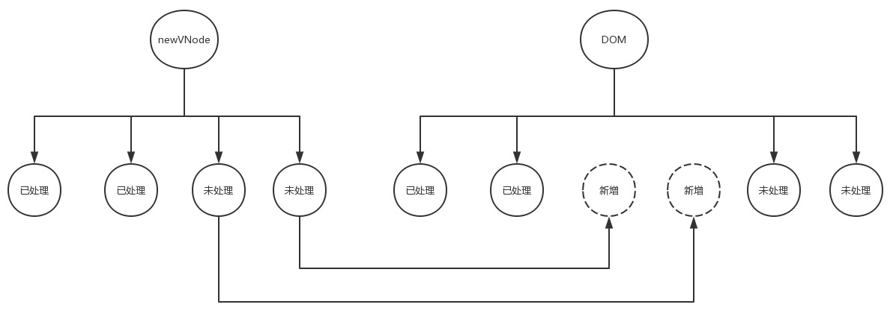

# v2.6.11 简易学习路线指南如下：

渐进式 JavaScript 框架（即有一个核心库，在需要的时候再逐渐添加插件的一种概念，大概意思就是你可以只用我的一部分，而不是用了我这一点就必须用我的所有部分）

vuejs 的组成是由 core 和 对应的 platforms 补充代码构成

vue 的目标是 通过尽可能简单的 API 实现响应的数据绑定 和 组合的视图组件

### 1.变化侦测篇

    双向绑定涉及到的技术：
    1. Object.defineProperty
    2. Observer 注入getter和setter
    3. Watcher 是变化侦测和更新view的一个纽带
    4. Dep 专门用来存储依赖用的,每个属性都有一个Dep
    5. Directive

#### Object 变化侦测篇

##### 学习 Vue 中如何实现数据的响应式系统，从而达到数据驱动视图。

    在Angular中是通过脏值检查流程来实现变化侦测；

    在React是通过对比虚拟DOM来实现变化侦测，

    在Vue中也有自己的一套变化侦测实现机制。

1.使 Object 数据变得“可观测” Observer 类 // [源码位置：src/core/observer/index.js](src/core/observer/index.js)

2.依赖收集 （在 getter 中收集依赖，在 setter 中通知依赖更新）Dep 类 // [源码位置：src/core/observer/dep.js](src/core/observer/dep.js)

3.依赖到底是谁 Watcher 类,watcher 主动将自己 push 到属性的依赖中,只有通过 watcher 读取属性的值才会收集依赖,模板是通过 watcher 读取属性的值的~ // [源码位置：src/core/observer/watcher.js](src/core/observer/watcher.js)

4.缺点 当我们向 object 数据里添加一对新的 key/value 或删除一对已有的 key/value 时，它是无法观测到的，导致当我们对 object 数据添加或删除值时，无法通知依赖，无法驱动视图进行响应式更新。当然，Vue 也注意到了这一点，为了解决这一问题，Vue 增加了两个全局 API:Vue.set 和 Vue.delete

##### 其整个流程大致如下：

    1.Data通过observer转换成了getter/setter的形式来追踪变化。
    2.当外界通过Watcher读取数据时，会触发getter从而将Watcher添加到依赖中。
    3.当数据发生了变化时，会触发setter，从而向Dep中的依赖（即Watcher）发送通知。
    4.Watcher接收到通知后，会向外界发送通知，变化通知到外界后可能会触发视图更新，也有可能触发用户的某个回调函数等

#### Array 变化侦测篇

1. 使 Array 型数据可观测（重新定义数组方法）数组方法拦截器 // [源码位置：src/core/observer/array.js](src/core/observer/array.js) 使用拦截器 // [源码位置：src/core/observer/index.js](src/core/observer/index.js)

2. 依赖收集，通知依赖// [源码位置：src/core/observer/index.js](src/core/observer/index.js) [源码位置 2: src/core/observer/array.js](src/core/observer/array.js)

3. 缺点：而使用下述例子中的操作方式来修改数组是无法侦测到的. Vue 增加了两个全局 API:Vue.set 和 Vue.delete

   ```
   let arr = [1,2,3]
   arr[0] = 5;       // 通过数组下标修改数组中的数据
   arr.length = 0    // 通过修改数组长度清空数组
   ```

##### 其整体流程如下：

    1.对于Array型数据也在getter中进行依赖收集
    2.创建了数组方法拦截器，从而成功的将数组数据变的可观测

### 2.虚拟 DOM 篇

#### 是什么？

    所谓虚拟DOM，就是用一个JS对象来描述一个DOM节点,如下事例：

```
<div class="a" id="b">文本内容</div>

{
    tag:'div',        // 元素标签
    attrs:{           // 属性
        class:'a',
        id:'b'
    },
    text:'文本内容',  // 文本内容
    children:[]       // 子元素
}
```

#### 为什么？

    1.Vue是数据驱动视图的，数据发生变化视图就要随之更新，在更新视图的时候难免要操作DOM,而操作真实DOM又是非常耗费性能的，这是因为浏览器的标准就把 DOM 设计的非常复杂，所以一个真正的 DOM 元素是非常庞大的

    2.用JS的计算性能来换取操作DOM所消耗的性能。（因为无法避免，那就只能尽量少的去操作DOM，对比变化，计算出更新，在操作需要更新的DOM）

#### 虚拟 DOM

1.VNode 类 // [源码位置：src/core/vdom/vnode.js](src/core/vdom/vnode.js)

2.VNode 的类型 // [源码位置：src/core/vdom/vnode.js](src/core/vdom/vnode.js)

> 注释节点

> 文本节点

> 克隆节点

> 元素节点 
    
    更贴近于我们通常看到的真实DOM节点，由于元素节点所包含的情况相比而言比较复杂，源码中没有像前三种节点一样直接写死

> 组件节点 
 
    组件节点除了有元素节点具有的属性之外，它还有两个特有的属性：
    componentOptions :组件的option选项，如组件的props等
    componentInstance :当前组件节点对应的Vue实例

> 函数式组件节点

    函数式组件节点相较于组件节点，它又有两个特有的属性：
    fnContext:函数式组件对应的Vue实例
    fnOptions: 组件的option选项

#### VNode的作用

在视图渲染之前，把写好的template模板先编译成VNode并缓存下来，等到数据发生变化页面需要重新渲染的时候，我们把数据发生变化后生成的VNode与前一次缓存下来的VNode进行对比，找出差异，然后有差异的VNode对应的真实DOM节点就是需要重新渲染的节点，最后根据有差异的VNode创建出真实的DOM节点再插入到视图中，最终完成一次视图更新

以JS的计算性能来换取操作真实DOM所消耗的性能

#### DOM-Diff

在Vue中，把 DOM-Diff过程叫做patch过程。patch,意为“补丁”，即指对旧的VNode修补，打补丁从而得到新的VNode

    整个patch无非就是干三件事：

    创建节点：新的VNode中有而旧的oldVNode中没有，就在旧的oldVNode中创建。
    删除节点：新的VNode中没有而旧的oldVNode中有，就从旧的oldVNode中删除。
    更新节点：新的VNode和旧的oldVNode中都有，就以新的VNode为准，更新旧的oldVNode。

> 创建节点

VNode类可以描述6种类型的节点，而实际上只有3种类型的节点能够被创建并插入到DOM中，它们分别是：元素节点、文本节点、注释节点。所以Vue在创建节点的时候会判断在新的VNode中有而旧的oldVNode中没有的这个节点是属于哪种类型的节点，从而调用不同的方法创建并插入到DOM中  [源码位置: src/core/vdom/patch.js
](src/core/vdom/patch.js)

流程图如下：


> 删除节点

[源码位置: src/core/vdom/patch.js
](src/core/vdom/patch.js)

> 更新节点

流程图如下：


>> 更新子节点

    这个过程将会存在以下四种情况：

    1.创建子节点：如果newChildren里面的某个子节点在oldChildren里找不到与之相同的子节点，那么说明newChildren里面的这个子节点是之前没有的，是需要此次新增的节点，那么就创建子节点。

    2.删除子节点：如果把newChildren里面的每一个子节点都循环完毕后，发现在oldChildren还有未处理的子节点，那就说明这些未处理的子节点是需要被废弃的，那么就将这些节点删除。

    3.移动子节点：如果newChildren里面的某个子节点在oldChildren里找到了与之相同的子节点，但是所处的位置不同，这说明此次变化需要调整该子节点的位置，那就以newChildren里子节点的位置为基准，调整oldChildren里该节点的位置，使之与在newChildren里的位置相同。

    4.更新节点：如果newChildren里面的某个子节点在oldChildren里找到了与之相同的子节点，并且所处的位置也相同，那么就更新oldChildren里该节点，使之与newChildren里的该节点相同。

>>  创建子节点

显然，把节点插入到DOM中是很容易的，找到 ***合适的位置*** 是关键。那么创建好之后如何插入到DOM中的 ***合适的位置*** 呢？。分析如图1：


分析如图2：



    分析总结：其实，应该把新创建的节点插入到所有未处理节点之前，这样以来逻辑才正确。后面不管有多少个新增的节点，每一个都插入到所有未处理节点之前，位置才不会错。

    所以，合适的位置是所有未处理节点之前，而并非所有已处理节点之后。

>> 删除子节点

>> 更新子节点

>> 移动子节点

同样，移动一个节点不难，关键在于该移动到哪，或者说关键在于移动到哪个 ***位置***，这个 ***位置***才是关键。如下图：


    分析总结：所有未处理节点之前就是我们要移动的目的位置。
    如果此时你说那可不可以移动到所有已处理节点之后呢？
    那就又回到了更新节点时所遇到的那个问题了：如果前面有新增的节点呢？

// [源码位置： src/core/vdom/patch.js](src/core/vdom/patch.js)

    总结：Vue在更新子节点时是外层循环newChildren数组，内层循环oldChildren数组，把newChildren数组里的每一个元素分别与oldChildren数组里的每一个元素匹配，根据不同情况作出创建子节点、删除子节点、更新子节点以及移动子节点的操作。

### 3.模板编译篇

    学习Vue内部是怎么把template模板编译成虚拟DOM,从而渲染出真实DOM

### 4.实例方法篇

    学习Vue中所有实例方法(即所有以$开头的方法)的实现原理

### 5.全局 API 篇

    习Vue中所有全局API的实现原理

### 6.生命周期篇

    学习Vue中组件的生命周期实现原理

### 7.指令篇

    学习Vue中所有指令的实现原理

### 8.过滤器篇

    学习Vue中所有过滤器的实现原理

### 9.内置组件篇

    学习Vue中内置组件的实现原理
